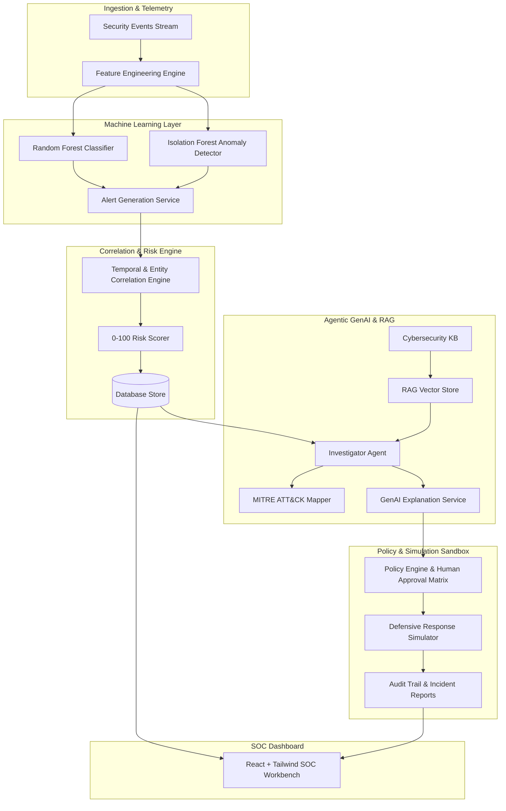

# CyberGuard AI: System Architecture

CyberGuard AI is a full-stack, AI-driven cybersecurity decision-support framework designed to bridge the gap between raw atomic telemetry, machine learning threat classification, agentic investigation, and safe defensive containment.

## Key Architectural Principles
1. **Real Supervised & Unsupervised ML**: No mocked values. Random Forest provides high-confidence multi-class attack categorization, and Isolation Forest scores anomalies.
2. **Grounded Agentic Investigation**: The AI investigator uses tools (`get_incident`, `get_related_events`, `get_asset_info`, `search_knowledge`) to anchor every conclusion in concrete telemetry.
3. **Safety Guarantee**: Defensive responses are strictly routed to the `simulator` module with simulated state mutations, audit logs, and prominent safety banners.
