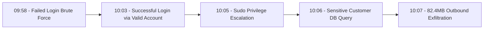

# CyberGuard AI: Demonstration & Evaluation Guide

This guide outlines the 4 pre-seeded demonstration scenarios, with special focus on **Scenario 4 (Incident CG-1021)** as the primary end-to-end multi-stage intrusion showcase for evaluation and presentation.

---

## Pre-Seeded Credentials
- **Analyst URL**: `http://localhost:5173`
- **Email**: `analyst@cyberguard.ai`
- **Password**: `CyberGuard2026!`

---

## Scenario Breakdown

### Scenario 1: Brute Force Authentication Anomaly (`CG-1015`)
- **Observed Telemetry**: 15+ rapid failed SSH logons targeting user `admin_ops` from external IP `198.51.100.12`.
- **ML Detection**: Random Forest flags `Brute Force` with 96% confidence; Isolation Forest flags numerical anomaly.
- **MITRE Mapping**: `Credential Access (TA0006)` -> `Brute Force (T1110.001)`.

### Scenario 2: Suspicious Privileged Activity (`CG-1018`)
- **Observed Telemetry**: Developer endpoint `endpoint-07` executing unauthorized `sudo chmod 777 /etc/sudoers.d/custom` and hidden user provisioning.
- **ML Detection**: `Privilege Escalation` flag.
- **MITRE Mapping**: `Privilege Escalation (TA0004)` -> `Abuse Elevation Control Mechanism: Sudo (T1548.003)`.

### Scenario 3: High-Volume Outbound Data Exfiltration (`CG-1019`)
- **Observed Telemetry**: Database host `server-db01` streaming a 47MB uncompressed SQL dump to external host `203.0.113.88` over port 4444.
- **ML Detection**: `Data Exfiltration` flag with high anomaly score.
- **MITRE Mapping**: `Exfiltration (TA0010)` -> `Exfiltration Over C2 Channel (T1041)`.

---

## Primary Major Scenario: Multi-Stage Intrusion (`Incident CG-1021`)

This scenario represents an end-to-end advanced cyber attack that tests every single layer of CyberGuard AI:

### Demonstration Flow:
1. **Login & SOC Overview**:
   - Log in with analyst credentials.
   - Observe the live pulse, threat activity chart peaks, and active incident counter.
2. **Explore Security Events & ML Alerts**:
   - Navigate to `/events` and inspect the raw JSON telemetry for `EVT-4001` through `EVT-4007`.
   - View `/alerts` showing real model probabilities.
3. **Open Incident CG-1021 Workbench**:
   - Navigate to `/incidents/CG-1021`.
   - Inspect the composite **Risk Score (88/100 Critical)**.
   - Review the **Reconstructed Event Timeline**.
   - Review the **MITRE ATT&CK Chain** visualizer (TA0006 $\to$ TA0001 $\to$ TA0004 $\to$ TA0009 $\to$ TA0010).
4. **Trigger Agentic AI Investigation**:
   - Click **Trigger AI Investigation**.
   - Observe the 5-step agent tool execution audit trail (`get_incident`, `get_related_events`, `get_asset_info`, `search_knowledge`, `ai_synthesis_engine`).
   - Interact with the AI Investigator in the Q&A box (e.g., *"Why was this incident classified as high risk?"*).
5. **Defensive Response Simulation**:
   - Click **Simulate Response** on `ISOLATE_ENDPOINT`.
   - Observe the Policy Engine requirement for Human Analyst Sign-off.
   - Check the authorization box, execute simulation, and confirm the green success banner: *"Simulation Only — Actual Infrastructure Not Modified."*
6. **Review Audit Trail & Generate Incident Report**:
   - Open `/audit` to verify the logged simulation event.
   - Open `/reports/CG-1021` and print/export the executive report.
