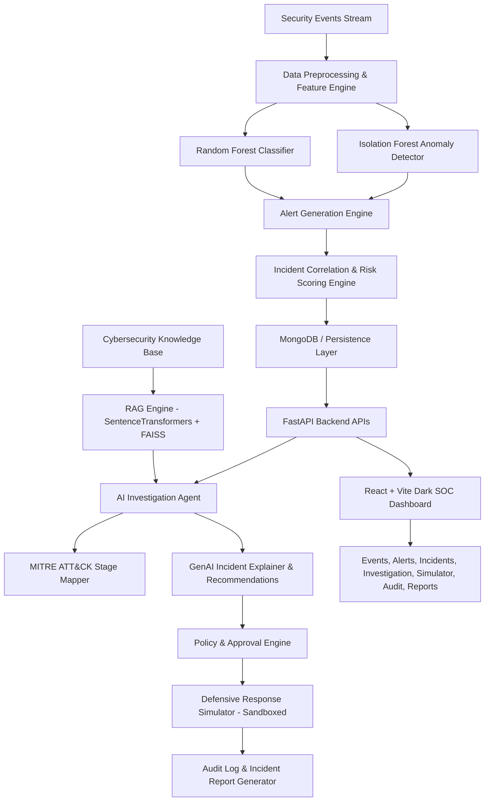

# CyberGuard AI: Full-Stack Implementation Plan

**CyberGuard AI** is an advanced cybersecurity decision-support framework combining Machine Learning (Supervised RF + Isolation Forest Anomaly Detection), Incident Correlation, RAG-grounded Generative AI Investigation, MITRE ATT&CK Stage Mapping, Safe Defensive Response Simulation, and a Dark SOC Dashboard.

---

## Architecture Overview



---

## User Review Required

> [!IMPORTANT]
> **LLM Provider Flexibility & Local Fallback**:
> The backend will provide a pluggable AI provider architecture (supporting Gemini API, OpenAI, and a built-in deterministic Heuristic Cybersecurity Specialist LLM Fallback). This guarantees the application runs and demonstrates seamlessly even before the user inputs their `LLM_API_KEY` or if offline, while unlocking real LLM reasoning once configured.
>
> **Database Resilience**:
> The backend will support MongoDB via Motor/PyMongo, with an automatic transparent local fallback (in-memory/embedded JSON document store) if a live MongoDB daemon isn't running on the host machine. This ensures zero demo crashes during evaluation.
>
> **Safety Guarantee**:
> All response actions (e.g., `ISOLATE_ENDPOINT`, `BLOCK_SOURCE`, `REVOKE_SESSION`) are strictly routed to the `simulator` module with simulated state mutations, audit trails, and the required banner: *"Simulation Only — Actual Infrastructure Not Modified."*

---

## Proposed Project Structure

```text
CYBER-GUARD-AI/
├── backend/
│   ├── app/
│   │   ├── api/
│   │   │   ├── auth.py
│   │   │   ├── dashboard.py
│   │   │   ├── events.py
│   │   │   ├── alerts.py
│   │   │   ├── incidents.py
│   │   │   ├── investigation.py
│   │   │   ├── rag.py
│   │   │   ├── response.py
│   │   │   ├── audit.py
│   │   │   └── reports.py
│   │   ├── core/
│   │   │   ├── config.py
│   │   │   ├── database.py
│   │   │   └── security.py
│   │   ├── ml/
│   │   │   ├── feature_engineering.py
│   │   │   ├── train.py
│   │   │   ├── predict.py
│   │   │   └── models/ (rf_model.joblib, if_model.joblib, scaler.joblib)
│   │   ├── correlation/
│   │   │   ├── engine.py
│   │   │   └── risk_scorer.py
│   │   ├── rag/
│   │   │   ├── ingestion.py
│   │   │   ├── retriever.py
│   │   │   └── vector_store.py
│   │   ├── agents/
│   │   │   ├── investigator.py
│   │   │   ├── tools.py
│   │   │   └── mitre_mapper.py
│   │   ├── services/
│   │   │   ├── ai_service.py
│   │   │   ├── alert_service.py
│   │   │   └── report_service.py
│   │   ├── simulator/
│   │   │   ├── policy.py
│   │   │   ├── simulator.py
│   │   │   └── audit.py
│   │   ├── schemas/ (pydantic schemas)
│   │   └── main.py
│   ├── datasets/
│   │   └── security_events_training.csv
│   ├── knowledge_base/
│   │   ├── authentication_security.md
│   │   ├── incident_response_playbooks.md
│   │   ├── network_and_exfiltration.md
│   │   ├── mitre_attack_mappings.md
│   │   └── response_policies.md
│   ├── scripts/
│   │   └── seed_demo_data.py
│   ├── tests/
│   └── requirements.txt
├── frontend/
│   ├── src/
│   │   ├── components/
│   │   │   ├── common/ (Navbar, Sidebar, StatCard, Badge, Modal, LoadingSkeleton)
│   │   │   ├── dashboard/ (ThreatChart, SeverityPie, CategoryBar, RecentAlertsTable)
│   │   │   ├── incidents/ (TimelineViewer, AttackChainGraph, EvidenceTable, AssetList)
│   │   │   ├── investigation/ (AIInvestigatorChat, GroundingTag, ToolExecutionView)
│   │   │   └── simulator/ (ResponseActionCard, SimulationStatusModal)
│   │   ├── pages/
│   │   │   ├── LoginPage.jsx
│   │   │   ├── DashboardPage.jsx
│   │   │   ├── EventsPage.jsx
│   │   │   ├── AlertsPage.jsx
│   │   │   ├── IncidentsPage.jsx
│   │   │   ├── IncidentDetailPage.jsx
│   │   │   ├── KnowledgeSearchPage.jsx
│   │   │   ├── SimulationPage.jsx
│   │   │   ├── AuditLogsPage.jsx
│   │   │   └── ReportViewPage.jsx
│   │   ├── layouts/
│   │   │   └── MainLayout.jsx
│   │   ├── services/
│   │   │   └── api.js
│   │   ├── context/
│   │   │   └── AuthContext.jsx
│   │   ├── App.jsx
│   │   ├── main.jsx
│   │   └── index.css
│   ├── package.json
│   ├── tailwind.config.js
│   ├── postcss.config.js
│   └── vite.config.js
├── docs/
│   ├── architecture.md
│   ├── api.md
│   ├── ml-pipeline.md
│   ├── rag.md
│   ├── agent-workflow.md
│   ├── database.md
│   ├── testing.md
│   └── demo.md
├── .env.example
├── docker-compose.yml
└── README.md
```

---

## Phased Execution Roadmap

### Phase 1: Environment & Project Foundation
- Initialize `backend/` with FastAPI, requirements, configuration, and database layer.
- Initialize `frontend/` with Vite + React + Tailwind CSS + Lucide Icons + Recharts + Axios.
- Establish project skeleton and `.env.example`.

### Phase 2: Database Schemas, Models & Seed Engine
- Build models for Users, Security Events, Alerts, Incidents, Investigations, Simulations, and Audit Logs.
- Implement `seed_demo_data.py` with 4 distinct realistic scenarios:
  1. **Scenario 1**: Brute-force authentication anomaly.
  2. **Scenario 2**: Suspicious privileged command escalation.
  3. **Scenario 3**: High-volume outbound data exfiltration.
  4. **Scenario 4**: End-to-end multi-stage incident `CG-1021` (Auth Failure $\to$ Login Success $\to$ Privileged Exec $\to$ Sensitive Access $\to$ Large Exfiltration).

### Phase 3: ML Pipeline & Prediction Service
- Create realistic cybersecurity training dataset generator & preprocessing pipeline.
- Implement and train:
  - Supervised **Random Forest Classifier** for multi-class attack classification (Brute Force, Privilege Escalation, Exfiltration, Normal).
  - Unsupervised **Isolation Forest** for numerical anomaly scoring (0.0 to 1.0).
- Save models with `joblib` and build the ML prediction inference engine with feature extractors.

### Phase 4: Alert Engine, Incident Correlation & Risk Scoring
- Build Alert generation triggered by ML predictions.
- Build the **Incident Correlation Engine** (clustering related events by sliding time-window, common entity: `user`, `source_ip`, `target_device`, and attack progression patterns).
- Implement configurable composite Risk Scorer ($0-100$).

### Phase 5: RAG System (Knowledge Base & Vector Search)
- Populate `knowledge_base/` with curated, real-world MITRE ATT&CK techniques, NIST playbooks, and response policies.
- Build chunking and embedding vector retriever using Sentence-Transformers / FAISS with fallback cosine indexing.
- Expose `POST /api/rag/search`.

### Phase 6: Agentic Investigation & GenAI Service Layer
- Create `ai_service.py` with structured Pydantic response parsing, grounded prompt templates, and strict evidence attribution.
- Build `investigator.py` agent with tools: `get_incident()`, `search_logs()`, `get_related_events()`, `get_asset()`, `search_knowledge()`, `generate_timeline()`.
- Implement MITRE ATT&CK mapping with stage progression tags.

### Phase 7: Policy Engine, Response Simulator & Safety Sandbox
- Build `simulator/policy.py` verifying response impact, requiring analyst sign-off for high-impact actions.
- Build `simulator/simulator.py` executing isolated sandbox state transitions (`REVOKE_SESSION`, `ISOLATE_ENDPOINT`, `BLOCK_SOURCE`, `INCREASE_MONITORING`).
- Log every simulation to `audit_logs` and display prominent sandbox guarantees.

### Phase 8: Incident Report & Audit Service
- Implement comprehensive report generator (`/api/reports/{incident_id}`) compiling executive summary, evidence timeline, MITRE stages, AI findings, and response simulation audit trail.

### Phase 9: React SOC Dashboard & Visual Frontend
- Build full Dark SOC design system (`index.css`, slate/emerald/amber/rose palette, glow accents, glassmorphic cards).
- Implement all pages:
  - Login (pre-seeded analyst credentials)
  - SOC Overview Dashboard (KPIs, time-series threat charts, attack distribution, recent alerts)
  - Events Explorer (faceted filtering, pagination, payload inspector)
  - Alerts Explorer
  - Incidents Explorer (severity/status filtering, risk scores)
  - **Incident Details & Investigation Center** (Timeline, Attack Chain visualizer, Asset grid, AI Investigator Chat with source citations, Recommendations, Response Simulator with Approval Modal)
  - RAG Knowledge Base Explorer
  - Response Simulator & Policy Dashboard
  - Audit Trail Log
  - Incident Report View & Print/Export
  
### Phase 10: Testing, Documentation & End-to-End Verification
- Unit & integration tests for ML inference, correlation, RAG retrieval, policy sandbox, and REST endpoints.
- Complete documentation in `docs/` and root `README.md`.
- End-to-end walkthrough verifying Scenario 4.

---

## Verification Plan

### Automated Tests
- Run pytest suite covering:
  - ML model prediction and anomaly scoring: `pytest backend/tests/test_ml.py`
  - Incident correlation engine: `pytest backend/tests/test_correlation.py`
  - Policy and simulator sandbox: `pytest backend/tests/test_simulator.py`
  - RAG vector search: `pytest backend/tests/test_rag.py`
  - API endpoints: `pytest backend/tests/test_api.py`

### Manual Verification
- Start FastAPI backend and Vite frontend.
- Log in with demo credentials (`analyst@cyberguard.ai` / `CyberGuard2026!`).
- Verify Dashboard KPIs and Recharts visualization.
- Browse Security Events & filter by severity.
- Open Incident `CG-1021`, trigger the AI Investigation, observe step-by-step tool execution, MITRE mapping, and timeline generation.
- Request simulated endpoint isolation (`ISOLATE_ENDPOINT`), approve action, confirm simulation success banner, and verify audit log record.
- Generate and view the Incident Report.
